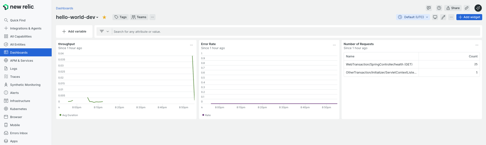

# DevOps Technical Challenge

Infrastructure is managed with Terragrunt + official Terraform Registry modules (VPC, ALB, Security Groups, ECR, CloudWatch Logs, ECS Cluster/Service). Each stack is self-contained and composes via Terragrunt `dependency` outputs.

## Contents
- [Overview of the Infrastructure](#overview-of-the-infrastructure)
- [Prerequisites and Setup](#prerequisites)
- [Architecture Diagram](#architecture-diagram)
- [How to Run Terraform](#how-to-run-terraform)
- [How to Build and Deploy the Application](#how-to-build-and-deploy-the-application)
- [Required AWS Credentials and Permissions](#required-aws-credentials-and-permissions)
- [Required GitHub Secrets](#ci-cd-github-actions)
- [New Relic Infrastructure (ECS)](#new-relic-infrastructure-ecs)
- [Disaster Recovery](#disaster-recovery)
- [Troubleshooting](#troubleshooting)
 - [Multi-Environment Support](#staging-environment)

## Overview of the Infrastructure
- VPC + Subnets: [infra/dev/us-east-1/vpc/vpc1](infra/dev/us-east-1/vpc/vpc1)
- Security Groups: [infra/dev/us-east-1/sgs/hello-world-alb-sg](infra/dev/us-east-1/sgs/hello-world-alb-sg), [infra/dev/us-east-1/sgs/hello-world-ecs-sg](infra/dev/us-east-1/sgs/hello-world-ecs-sg)
- Load Balancer (ALB): [infra/dev/us-east-1/alb/hello-world-alb](infra/dev/us-east-1/alb/hello-world-alb)
- ECR Repository: [infra/dev/us-east-1/ecr/hello-world](infra/dev/us-east-1/ecr/hello-world)
- ECS Cluster: [infra/dev/us-east-1/ecs-clusters/hello-world-cluster](infra/dev/us-east-1/ecs-clusters/hello-world-cluster)
- ECS Service (Fargate): [infra/dev/us-east-1/ecs-services/hello-world-service](infra/dev/us-east-1/ecs-services/hello-world-service)
- CloudWatch Logs (optional): [infra/dev/us-east-1/logs](infra/dev/us-east-1/logs)
- Shared module wiring: [infra/_envcommon](infra/_envcommon)

Key characteristics:
- Uses official terraform-aws-modules for all major components
- ALB forwards traffic to an ECS Fargate service
- Container image sourced from ECR
- Least-privilege IAM with separate task execution vs application task roles

## Architecture Diagram

```
					Internet
						 |
					 Route 53
						 |
					 Application Load Balancer
						 |
				┌──── Target Group ────┐
				│        (IP)          │
				v                       v
		  ECS Service (Fargate)  <—  ECS Cluster
				│
				│  pulls image from
				v
			Amazon ECR

 CloudWatch Logs  ← ECS/ALB logs + metrics
		 IAM        ← Task execution role + app task role
		 VPC        ← Subnets, routing, security groups
```

## Prerequisites
- Terraform 1.5.7
- Terragrunt (latest)
- AWS CLI configured (via `AWS_PROFILE`, `AWS_ACCESS_KEY_ID`/`AWS_SECRET_ACCESS_KEY`, or SSO)
- (Optional) Remote state S3 bucket and DynamoDB lock table
	- Remote state is disabled by default. To enable, export:
		- `TF_STATE_BUCKET` — S3 bucket name
		- `TF_STATE_REGION` — e.g. `us-east-1`
		- `TF_STATE_LOCK_TABLE` — DynamoDB table name (optional)
		- `TERRAGRUNT_DISABLE_INIT=false`
	- See [infra/terragrunt.hcl](infra/terragrunt.hcl)

## Folder Structure
- infra/
	- _envcommon/ (shared module wiring)
		- [vpc.hcl](infra/_envcommon/vpc.hcl)
		- [alb.hcl](infra/_envcommon/alb.hcl)
		- [sg.hcl](infra/_envcommon/sg.hcl)
		- [ecr.hcl](infra/_envcommon/ecr.hcl)
		- [logs.hcl](infra/_envcommon/logs.hcl)
		- [ecs-cluster.hcl](infra/_envcommon/ecs-cluster.hcl)
	- dev/
		- [account.hcl](infra/dev/account.hcl)
		- us-east-1/
			- [region.hcl](infra/dev/us-east-1/region.hcl)
			- alb/
				- hello-world-alb/terragrunt.hcl
			- ecr/
				- hello-world/terragrunt.hcl
			- ecs-clusters/
				- hello-world-cluster/terragrunt.hcl
			- ecs-services/
				- hello-world-service/terragrunt.hcl
			- logs/
				- <optional log-group stacks>
			- sgs/
				- hello-world-alb-sg/terragrunt.hcl
				- hello-world-ecs-sg/terragrunt.hcl
			- vpc/
				- vpc1/terragrunt.hcl

Application container assets:
- app/
	- hello-world/
		- Dockerfile, .dockerignore, README

## Module Sources
All stacks use official modules via Git sources:
- VPC: `terraform-aws-modules/terraform-aws-vpc`
- ALB: `terraform-aws-modules/terraform-aws-alb`
- Security Group: `terraform-aws-modules/terraform-aws-security-group`
- ECR: `terraform-aws-modules/terraform-aws-ecr`
- CloudWatch Logs: `terraform-aws-modules/terraform-aws-cloudwatch` (log group submodule)
- ECS Cluster & Service: `terraform-aws-modules/terraform-aws-ecs` (service from master branch for TF 1.5.7 + AWS provider >= 6.21)

## Environment Configuration
- Set environment in [infra/dev/account.hcl](infra/dev/account.hcl)
- Set region in [infra/dev/us-east-1/region.hcl](infra/dev/us-east-1/region.hcl)
	- Ensure it matches your target region (e.g., `us-east-1`).
- Provider is generated per stack; you can also override via `AWS_REGION` env var.

## Staging Environment
- Reuse the same shared modules in [infra/_envcommon](infra/_envcommon) to create a staging environment.
- Create a new environment folder parallel to `dev/`, for example:

```
infra/
	_envcommon/
	dev/
		us-east-1/
			...
	staging/
		account.hcl
		us-east-1/
			region.hcl
			vpc/
				vpc1/terragrunt.hcl
			sgs/
				hello-world-alb-sg/terragrunt.hcl
				hello-world-ecs-sg/terragrunt.hcl
			alb/
				hello-world-alb/terragrunt.hcl
			ecr/
				hello-world/terragrunt.hcl
			ecs-clusters/
				hello-world-cluster/terragrunt.hcl
			ecs-services/
				hello-world-service/terragrunt.hcl
```

- In `staging/account.hcl`, set `locals.environment = "staging"` to tag resources accordingly.
- In `staging/us-east-1/region.hcl`, set your target region (for example `us-east-1`).
- Each stack should include its corresponding envcommon module file (e.g., ALB stacks include [infra/_envcommon/alb.hcl](infra/_envcommon/alb.hcl)).
- Remote state keys automatically remain distinct per folder via [infra/terragrunt.hcl](infra/terragrunt.hcl) using `path_relative_to_include()`.

Apply staging the same way as dev:
```bash
cd infra/staging/us-east-1/vpc/vpc1 && terragrunt apply
cd ../../sgs/hello-world-alb-sg && terragrunt apply
cd ../../sgs/hello-world-ecs-sg && terragrunt apply
cd ../../alb/hello-world-alb && terragrunt apply
cd ../../ecr/hello-world && terragrunt apply
cd ../../ecs-clusters/hello-world-cluster && terragrunt apply
cd ../../ecs-services/hello-world-service && terragrunt apply
```

Tips:
- If staging uses a different AWS account, export credentials or assume-role before apply.
- Use `terragrunt run-all plan`/`apply` from `infra/staging/us-east-1` to orchestrate all stacks.

## Build Order (Dev us-east-1)
Apply in this order to satisfy dependencies:
1) VPC
	 - [infra/dev/us-east-1/vpc/vpc1](infra/dev/us-east-1/vpc/vpc1)
2) Security Groups
	 - [infra/dev/us-east-1/sgs/hello-world-alb-sg](infra/dev/us-east-1/sgs/hello-world-alb-sg)
	 - [infra/dev/us-east-1/sgs/hello-world-ecs-sg](infra/dev/us-east-1/sgs/hello-world-ecs-sg)
3) ALB
	 - [infra/dev/us-east-1/alb/hello-world-alb](infra/dev/us-east-1/alb/hello-world-alb)
4) ECR
	 - [infra/dev/us-east-1/ecr/hello-world](infra/dev/us-east-1/ecr/hello-world)
5) Logs (optional)
	 - [infra/dev/us-east-1/logs](infra/dev/us-east-1/logs)
6) ECS Cluster
	 - [infra/dev/us-east-1/ecs-clusters/hello-world-cluster](infra/dev/us-east-1/ecs-clusters/hello-world-cluster)
7) ECS Service
	 - [infra/dev/us-east-1/ecs-services/hello-world-service](infra/dev/us-east-1/ecs-services/hello-world-service)

## How to Run Terraform
From each stack directory:
```bash
terragrunt init -upgrade
terragrunt validate
terragrunt plan
terragrunt apply
```

Tips:
- For quicker `validate/plan` runs, stacks use `mock_outputs` for upstream dependencies; real values resolve on `apply`.
- Remote state: export the variables listed in Prerequisites and re-run `terragrunt init`.

## How to Build and Deploy the Application
- The ECS service references the ECR repo output and uses `:latest` by default.
- To build and push an image after creating the ECR repo:
```bash
AWS_REGION=us-east-1 ACCOUNT_ID=$(aws sts get-caller-identity --query Account --output text)
REPO=hello-world
IMAGE=$ACCOUNT_ID.dkr.ecr.$AWS_REGION.amazonaws.com/$REPO:latest

aws ecr get-login-password --region $AWS_REGION | docker login --username AWS --password-stdin $ACCOUNT_ID.dkr.ecr.$AWS_REGION.amazonaws.com
docker build -f devops-technical-challenge/app/hello-world/Dockerfile -t $IMAGE .
docker push $IMAGE
```

- Deploy via Terragrunt by applying the ECS service stack:
```bash
cd infra/dev/us-east-1/ecs-services/hello-world-service
terragrunt apply
```
- Or let CI/CD handle deploys on push to `main` via [.github/workflows/deploy.yml](.github/workflows/deploy.yml).

## Required AWS Credentials and Permissions
Your deploying identity (CLI/Terragrunt/GitHub Actions) needs permissions to manage these resources:
- VPC/Subnets/SecurityGroups: ec2
- ALB/Target Group/Listener: elasticloadbalancing (ELBv2)
- ECR: ecr for repo creation and push/pull operations
- ECS Cluster/Service/Task Definition: ecs
- CloudWatch Logs: logs
- IAM for ECS roles: iam:CreateRole, iam:AttachRolePolicy, iam:PassRole (limited to roles created for ECS)
- S3 (optional, if your task accesses a bucket): s3:GetObject, s3:PutObject, s3:ListBucket on the specific bucket/prefix

Recommendation: use a least-privilege role scoped to a project-specific prefix/tag rather than AdministratorAccess.

## Least-Privilege IAM
- Task Execution Role: only the AWS-managed `AmazonECSTaskExecutionRolePolicy` (image pull + logs).
- Task Role: deny-by-default. Add scoped statements as needed (e.g., S3 read/write to a specific bucket/prefix). The service currently grants:
	- `s3:ListBucket` on the chosen bucket
	- `s3:GetObject`, `s3:PutObject` on `bucket/*`
	- Override bucket via `S3_BUCKET_NAME` env var before plan/apply.

## CI/CD (GitHub Actions)
- Workflow: [.github/workflows/deploy.yml](.github/workflows/deploy.yml)
- Triggers:
	- Push to `main`: build, test, build/push Docker to ECR, deploy to dev ECS
	- Pull Request: build + unit tests only
	- Workflow dispatch: manual production deployment with approval gate (GitHub Environments)
- Required GitHub Secrets:
	- `AWS_ACCESS_KEY_ID`
	- `AWS_SECRET_ACCESS_KEY`
	- `AWS_REGION` (e.g., `us-east-1`)
	- `AWS_ACCOUNT_ID`
	- `ECR_REPOSITORY` (e.g., `hello-world`)
	- `ECS_CLUSTER_NAME` (e.g., `hello-world-cluster`)
	- `ECS_SERVICE_NAME` (e.g., `hello-world-service`)
	- `SLACK_WEBHOOK_URL` (optional, for failure notifications)
- Notes:
	- The workflow uses a multi-stage Docker build and tags the image with both the commit SHA and `latest`.
	- Dev deploy job auto-registers a new task definition by cloning the current one and updating the image.
	- Production job uses `environment: production`. Configure environment protection rules and required reviewers in GitHub → Settings → Environments to enforce manual approval.

## New Relic Infrastructure (ECS)

This project supports New Relic for both infrastructure metrics (via the AWS→New Relic integration) and application errors (via the New Relic Java agent already included in the container).

### 1) Connect AWS to New Relic (Infrastructure)

- In New Relic, go to Integrations → Amazon Web Services → Add an account.
- Create the IAM role for New Relic using the guided CloudFormation flow (preferred) or Terraform. This grants New Relic read-only access to CloudWatch metrics including ECS and ALB.
- Ensure the ECS namespace is enabled. Optionally enable Metric Streams for lower-latency metrics.

Notes:
- Do not commit license keys. The sample file at [newrelic-infra/newrelic-infra.yml](newrelic-infra/newrelic-infra.yml) should be replaced by secrets in AWS Secrets Manager or SSM Parameter Store and referenced from the ECS task definition.

### Agent configuration in Dockerfile
- The Java agent is installed and enabled in [app/hello-world/Dockerfile](app/hello-world/Dockerfile):
	- `newrelic.jar` and `newrelic.yml` are downloaded at build time.
	- `JAVA_OPTS` includes `-javaagent:/app/newrelic.jar` and sets `newrelic.config.app_name` and `newrelic.config.license_key` from environment.
	- Provide `NEW_RELIC_LICENSE_KEY` as a secret (ECS task definition) and set `NEW_RELIC_APP_NAME` as an environment variable.
	- Entrypoint runs `java $JAVA_OPTS -jar /app/app.jar` so the agent is active.

Required configuration (secrets/credentials)
- `NEW_RELIC_LICENSE_KEY`: Store in AWS Secrets Manager or SSM; reference in the ECS task definition as a container secret.
- `NEW_RELIC_APP_NAME`: Set as a container environment variable (e.g., `hello-world-dev`).
- (Optional) `newrelic.yml`: The default file bundled in the image is sufficient; you can override via mounted file or environment.

How New Relic is integrated
- Infrastructure metrics arrive via AWS→New Relic integration (CloudWatch-based) once your AWS account is connected.
- Application telemetry (transactions, errors, JVM metrics) arrives via the Java agent running inside the ECS task.

How to access and view metrics
- In New Relic → Infrastructure → AWS → ECS and ALB: view CPU/Memory, RequestCount, TargetResponseTime, and 5XX metrics.
- In APM → select `NEW_RELIC_APP_NAME`: view transactions, error rates, traces, JVM metrics.
- Use Data Explorer to run ad-hoc NRQL on `Metric`, `Transaction`, `TransactionError`, and `Log` (if logs are forwarded).

Alert configuration
- CPU (ECS service): use an NRQL condition such as:
	- `FROM Metric SELECT latest(aws.ecs.CPUUtilization) WHERE aws.ecs.clusterName = 'hello-world-cluster' AND aws.ecs.serviceName = 'hello-world-service'`
	- Static threshold: above 80 for 2 minutes.
- Memory (ECS service):
	- `FROM Metric SELECT latest(aws.ecs.MemoryUtilization) WHERE aws.ecs.clusterName = 'hello-world-cluster' AND aws.ecs.serviceName = 'hello-world-service'`
	- Static threshold: above 80 for 2 minutes.
- App errors (APM):
	- `FROM TransactionError SELECT rate(count(*), 1 minute) WHERE appName = 'hello-world-dev'`
	- Static threshold: above 1 for 5 minutes.
- App errors (Logs — optional):
	- `FROM Log SELECT count(*) WHERE service IN ('hello-world','hello-world-dev') AND level IN ('ERROR','FATAL')`
	- Static threshold: above 1 for 5 minutes.

CloudWatch Logs (Terraform and options)
- Log groups can be provisioned via [infra/_envcommon/logs.hcl](infra/_envcommon/logs.hcl) using the official CloudWatch Log Group submodule.
- To forward logs to New Relic, choose one:
	- FireLens (Fluent Bit) on ECS tasks → New Relic Logs endpoint.
	- CloudWatch Logs → Kinesis Firehose or Lambda forwarder to New Relic.
- If you want code examples for FireLens or a log forwarder, I can add a dedicated stack under `infra/dev/us-east-1/logs/`.

Dashboard screenshot




### 2) Enable application error visibility (APM)

The `app/hello-world` image already includes the New Relic Java agent. Provide the following at deploy time (ECS task definition):
- `NEW_RELIC_LICENSE_KEY`: Store in AWS Secrets Manager or SSM and surface via task definition secrets.
- `NEW_RELIC_APP_NAME`: A friendly service name, for example `hello-world-dev`.

Example (in the ECS service container definition):
- Add environment: `NEW_RELIC_APP_NAME=hello-world-dev`.
- Add secret (from Secrets Manager/SSM): `NEW_RELIC_LICENSE_KEY`.

With these set, application errors/exceptions will appear in APM and Events (e.g., `TransactionError`).

### 3) Optional: Logs for error alerts

If you prefer to alert off logs (e.g., `level = ERROR`), forward logs to New Relic via:
- FireLens (Fluent Bit) to New Relic Logs endpoint, or
- CloudWatch Logs → New Relic logs forwarder (Lambda) or Kinesis Firehose.

### 4) Create alerts in New Relic

Create an Alert Policy (Alerts & AI → Policies) and add the following conditions. You can either:
- Use the guided ECS conditions in the UI (recommended), or
- Use NRQL conditions. The NRQL below are templates; validate metric names/dimensions in New Relic Data Explorer for your account, as naming can vary by integration mode.

High CPU utilization (> 80%)
- Condition type: NRQL
- Query (template):
	- Option A (CloudWatch-mapped metrics):
		FROM Metric SELECT latest(aws.ecs.CPUUtilization)
		WHERE aws.ecs.clusterName = 'hello-world-cluster'
			AND aws.ecs.serviceName = 'hello-world-service'
	- Option B (namespace/dimension form):
		FROM Metric SELECT latest(`AWS/ECS.CPUUtilization`)
		WHERE ClusterName = 'hello-world-cluster' AND ServiceName = 'hello-world-service'
- Threshold: Static, above 80 for 2 consecutive minutes.

High memory utilization (> 80%)
- Condition type: NRQL
- Query (template):
	- Option A:
		FROM Metric SELECT latest(aws.ecs.MemoryUtilization)
		WHERE aws.ecs.clusterName = 'hello-world-cluster'
			AND aws.ecs.serviceName = 'hello-world-service'
	- Option B:
		FROM Metric SELECT latest(`AWS/ECS.MemoryUtilization`)
		WHERE ClusterName = 'hello-world-cluster' AND ServiceName = 'hello-world-service'
- Threshold: Static, above 80 for 2 consecutive minutes.

Application errors or exceptions
- Option 1 — APM errors (requires Java agent):
	- Query:
		FROM TransactionError SELECT rate(count(*), 1 minute)
		WHERE appName = 'hello-world-dev'
	- Threshold: Static, above 1 for 5 minutes (tune to your baseline).
- Option 2 — Logs (if forwarding logs):
	- Query:
		FROM Log SELECT count(*) WHERE service IN ('hello-world','hello-world-dev') AND level IN ('ERROR','FATAL')
	- Threshold: Static, above 1 for 5 minutes.

Routing and notifications
- Attach your preferred notification channels (Email, Slack, Teams, Webhook). For production, consider separate policies/environments with stricter thresholds.

Validation checklist
- Data Explorer shows ECS and ALB metrics arriving for your AWS account.
- APM shows transactions and any errors for `NEW_RELIC_APP_NAME`.
- Test alerts by temporarily lowering thresholds or load-testing the service.

## Disaster Recovery
This section documents backup and recovery procedures for the stateless Java application deployed on ECS Fargate. If your application uses external state (e.g., S3, RDS, DynamoDB), include those services in the backup plan.

DR objectives
- Define RPO (data loss tolerance) and RTO (time to restore). For a stateless web API, RPO ~ 0 and RTO ~ minutes are typical when images and infra are reproducible.

Backups and replication
- ECR images:
	- Use immutable tags for releases (e.g., `v1.2.3`) in addition to `latest`.
	- Enable ECR cross-region replication to a DR region.
	- Keep a minimal set of “known good” tags for rollback.
- Terraform remote state:
	- Use an S3 bucket with versioning enabled and (optional) cross-region replication. See [infra/terragrunt.hcl](infra/terragrunt.hcl) for backend config.
	- DynamoDB lock table: enable point-in-time recovery.
- Application data (if used):
	- S3: enable versioning and cross-region replication on buckets accessed by the app.
	- RDS/DynamoDB: enable automated snapshots/backups and PITR.

Operational runbooks
- Roll back ECS service to previous task definition:
```bash
ECS_CLUSTER_NAME=hello-world-cluster
ECS_SERVICE_NAME=hello-world-service

# Get current task definition
aws ecs describe-services \
	--cluster "$ECS_CLUSTER_NAME" \
	--services "$ECS_SERVICE_NAME" \
	--query 'services[0].taskDefinition' --output text

# List task definitions by family and pick the previous ARN
aws ecs list-task-definitions \
	--family-prefix "$ECS_SERVICE_NAME" \
	--sort DESC --query 'taskDefinitionArns[0:5]'

# Update service to use a previous task definition ARN
aws ecs update-service \
	--cluster "$ECS_CLUSTER_NAME" \
	--service "$ECS_SERVICE_NAME" \
	--task-definition arn:aws:ecs:us-east-1:ACCOUNT_ID:task-definition/hello-world-service:REV \
	--force-new-deployment
```
- Restore from a known-good image tag:
```bash
AWS_REGION=us-east-1 ACCOUNT_ID=$(aws sts get-caller-identity --query Account --output text)
IMAGE_URI=${ACCOUNT_ID}.dkr.ecr.${AWS_REGION}.amazonaws.com/hello-world:v1.2.3

# Re-register task definition with the stable image
TD_ARN=$(aws ecs describe-services --cluster "$ECS_CLUSTER_NAME" --services "$ECS_SERVICE_NAME" --query 'services[0].taskDefinition' --output text)
aws ecs describe-task-definition --task-definition "$TD_ARN" --include TAGS \
	| jq '.taskDefinition.containerDefinitions |= map(.image = env.IMAGE_URI) | {family: .taskDefinition.family, taskRoleArn: .taskDefinition.taskRoleArn, executionRoleArn: .taskDefinition.executionRoleArn, networkMode: .taskDefinition.networkMode, containerDefinitions: .taskDefinition.containerDefinitions, volumes: .taskDefinition.volumes, placementConstraints: .taskDefinition.placementConstraints, requiresCompatibilities: .taskDefinition.requiresCompatibilities, cpu: .taskDefinition.cpu, memory: .taskDefinition.memory, runtimePlatform: .taskDefinition.runtimePlatform, ephemeralStorage: .taskDefinition.ephemeralStorage}' > td.json
NEW_TD_ARN=$(aws ecs register-task-definition --cli-input-json file://td.json --query 'taskDefinition.taskDefinitionArn' --output text)
aws ecs update-service --cluster "$ECS_CLUSTER_NAME" --service "$ECS_SERVICE_NAME" --task-definition "$NEW_TD_ARN" --force-new-deployment
```
- Region failover (active/passive):
	- Provision a parallel stack in a DR region (e.g., `us-west-2`) using the same [infra/_envcommon](infra/_envcommon) modules.
	- Use Route 53 failover records with health checks targeting the ALB in the primary region; switch to DR when primary is unhealthy.
	- Keep ECR replication and SSM/Secrets synchronized across regions.

Testing and validation
- Conduct periodic DR drills: simulate rollback and regional failover.
- Verify RPO/RTO targets and refine alerts/runbooks accordingly.

## Troubleshooting
- If `region.hcl` doesn’t match your target region, provider operations may fall back to `AWS_REGION`. Keep them consistent.
- Ensure ALB target group outputs exist before applying ECS service.
- Confirm ECR image is pushed (and tag matches) before first ECS service rollout.
 - Rotate any plaintext secrets committed accidentally (e.g., New Relic license key) and move them to AWS Secrets Manager/SSM.
 - If `terragrunt` fails to find dependencies during `validate/plan`, ensure you are running from the correct stack folder and upstream stacks exist; mocks are used only for planning.
